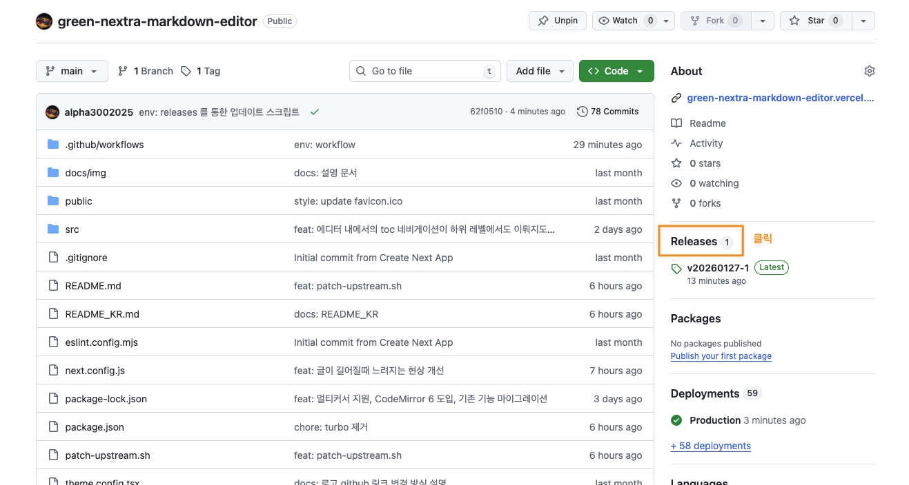

This is a [Next.js](https://nextjs.org) project bootstrapped with [`create-next-app`](https://nextjs.org/docs/pages/api-reference/create-next-app).<br/>

한국어 설명은 [여기](./README_KR.md) 를 참고해주세요.<br/>

<br/>

# Introduction
- This project is a customized version of Nextra (https://github.com/shuding/nextra).
- The official GitHub repository for the current markdown-editor project blog is https://github.com/alpha3002025/green-nextra-markdown-editor.
- **Dual Mode**: It functions as both a Markdown editor and viewer in `localhost`, while serving as a dedicated documentation viewer in `production`.

<br/>
<br/>

## Getting Started

First, run the development server:

```bash
npm run dev
# or
yarn dev
# or
pnpm dev
# or
bun dev
```

Open [http://localhost:3000](http://localhost:3000) with your browser to see the result.

You can start editing the page by modifying `pages/index.tsx`. The page auto-updates as you edit the file.

[API routes](https://nextjs.org/docs/pages/building-your-application/routing/api-routes) can be accessed on [http://localhost:3000/api/hello](http://localhost:3000/api/hello). This endpoint can be edited in `pages/api/hello.ts`.

The `pages/api` directory is mapped to `/api/*`. Files in this directory are treated as [API routes](https://nextjs.org/docs/pages/building-your-application/routing/api-routes) instead of React pages.

This project uses [`next/font`](https://nextjs.org/docs/pages/building-your-application/optimizing/fonts) to automatically optimize and load [Geist](https://vercel.com/font), a new font family for Vercel.


## Update Features - Using Releases

We support shell scripts to update features in two ways:

- Update to the **latest** release version (`update-from-release.sh`)
- Update to a **specific** release version (`update-from-specific-version.sh`)

<br/>

(1) Update to the latest release version

```bash
source update-from-release.sh
```

<br/>

(2) Update to a specific release version

```bash
source update-from-specific-version.sh {{Release Version}}
```

<br/>

You can find the `{{Release Version}}` in the **Releases** section of the GitHub repository.


<br/>
<br/>

**💡💡💡 What if you don't see `update-from-release.sh`, `specific-version.sh`, or `patch-upstream.sh`?**<br/>
You might be visiting this repository from a very early version of the project. Please download them directly via the links below and execute them. After that, you will be able to update to the latest version.
- update-from-release.sh : https://github.com/alpha3002025/green-nextra-markdown-editor/blob/main/update-from-release.sh
- update-from-specific-version.sh : https://github.com/alpha3002025/green-nextra-markdown-editor/blob/main/update-from-specific-version.sh
- patch-upstream.sh : https://github.com/alpha3002025/green-nextra-markdown-editor/blob/main/patch-upstream.sh

<br/>
<br/>

## Update Features - Using GitHub

Run the following command to update the latest features from the upstream repository:

```bash
source patch-upstream.sh
```

## Learn More

To learn more about Next.js, take a look at the following resources:

- [Next.js Documentation](https://nextjs.org/docs) - learn about Next.js features and API.
- [Learn Next.js](https://nextjs.org/learn-pages-router) - an interactive Next.js tutorial.

You can check out [the Next.js GitHub repository](https://github.com/vercel/next.js) - your feedback and contributions are welcome!

## Deploy on Vercel

The easiest way to deploy your Next.js app is to use the [Vercel Platform](https://vercel.com/new?utm_medium=default-template&filter=next.js&utm_source=create-next-app&utm_campaign=create-next-app-readme) from the creators of Next.js.

Check out our [Next.js deployment documentation](https://nextjs.org/docs/pages/building-your-application/deploying) for more details.
