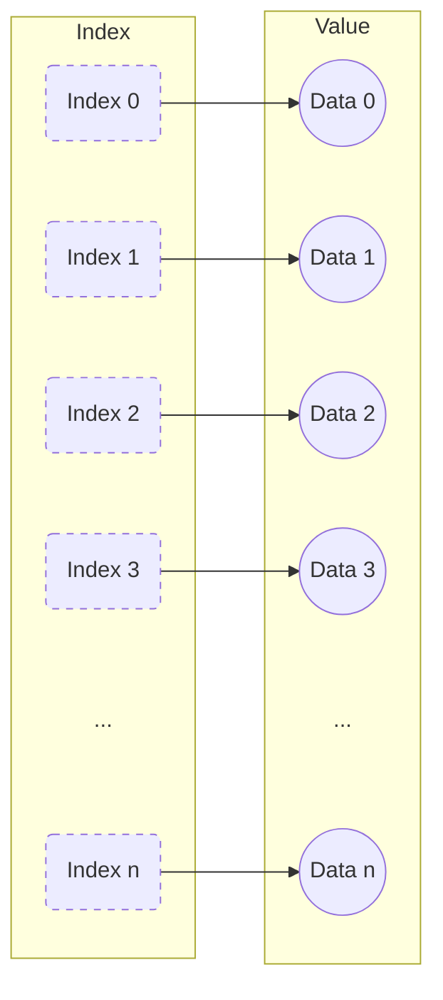

# Mermaid

```mermaid
graph LR
    subgraph Index
        direction TB
        i0(Index 0)
        i1(Index 1)
        i2(Index 2)
        i3(Index 3)
        id(...)
        in(Index n)
    end
    subgraph Value
        direction TB
        v0((Data 0))
        v1((Data 1))
        v2((Data 2))
        v3((Data 3))
        vd(...)
        vn((Data n))
    end
    
    i0 --> v0
    i1 --> v1
    i2 --> v2
    i3 --> v3
    in --> vn
    
    style i0 stroke-dasharray: 5 5
    style i1 stroke-dasharray: 5 5
    style i2 stroke-dasharray: 5 5
    style i3 stroke-dasharray: 5 5
    style in stroke-dasharray: 5 5
    style id stroke:none,fill:none
    style vd stroke:none,fill:none
```